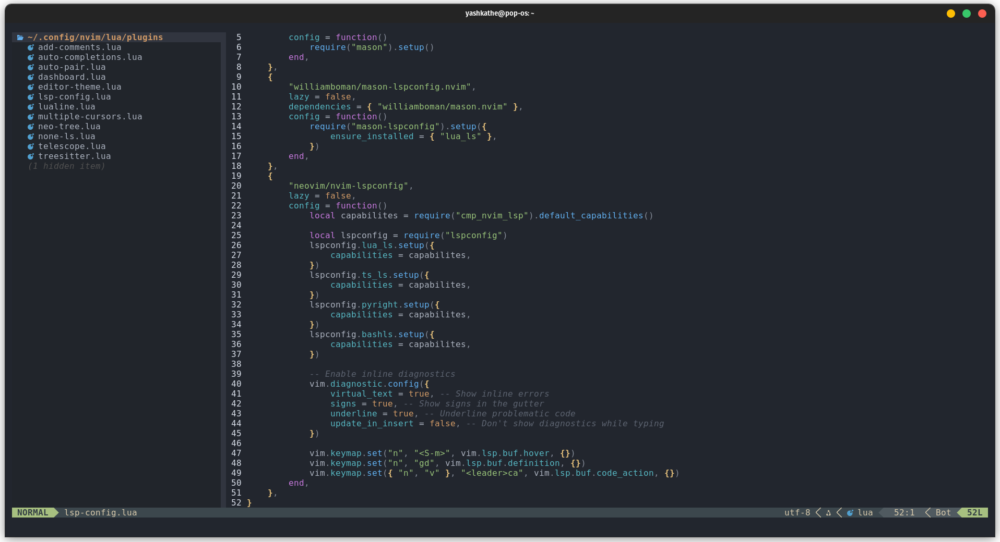

# My Dot Files and Scripts

<div align="center">


</div>

## Instructions

### - sys-update

updates the whole system - placed in _/usr/local/bin/_

### - vimrc

open vim and type

```bash
:PlugInstall
```

### neovim and tmux

<div align="center">




</div>

### ncspot and cava with tmux

<div align="center">


</div>
